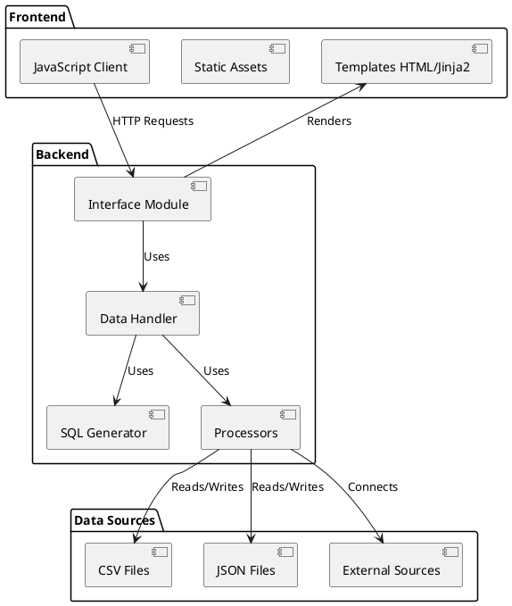
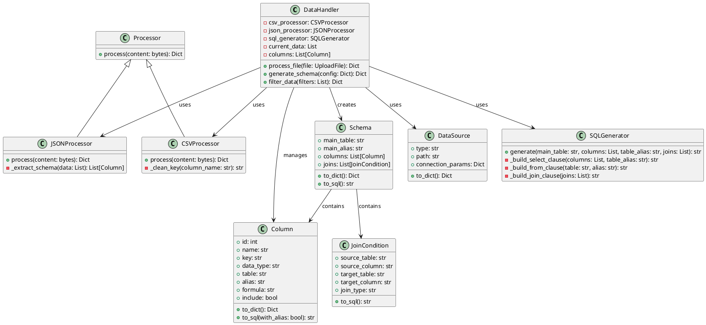
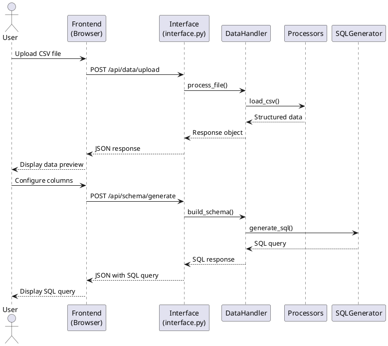

# Documentation d'Architecture - Data-eyes

Ce document présente l'architecture technique détaillée du projet Data-eyes, incluant les diagrammes de classe, les flux de données et les interactions entre composants.

## Table des matières

1. [Vue d'ensemble](#vue-densemble)
2. [Architecture applicative](#architecture-applicative)
3. [Diagramme de classes](#diagramme-de-classes)
4. [Flux de données](#flux-de-données)
5. [Composants principaux](#composants-principaux)
6. [Interactions Frontend-Backend](#interactions-frontend-backend)
7. [Gestion des données](#gestion-des-données)
8. [Schéma de la base de données](#schéma-de-la-base-de-données)

## Vue d'ensemble

Data-eyes est une application web suivant le pattern MVC (Modèle-Vue-Contrôleur) adaptée pour FastAPI. L'application se compose des éléments suivants :

- **Frontend** : Interface utilisateur web développée avec HTML, CSS et JavaScript, rendue par Jinja2
- **Backend** : API REST développée avec FastAPI en Python
- **Processeurs de données** : Modules de traitement pour différents formats de données
- **Générateur SQL** : Module de génération de requêtes SQL basées sur les configurations utilisateur

### Diagramme d'architecture globale

```
+-------------------+          +---------------------+
|                   |          |                     |
|  Interface Web    |<-------->|  FastAPI Backend    |
|  (HTML/CSS/JS)    |   HTTP   |                     |
|                   |          |                     |
+-------------------+          +---------+-----------+
                                         |
                                         | Utilise
                                         v
                      +------------------+------------------+
                      |                                     |
                      |  +----------------+  +-----------+  |
                      |  |                |  |           |  |
                      |  | Processeurs    |  | Générateur|  |
                      |  | de Données     |  | SQL       |  |
                      |  |                |  |           |  |
                      |  +----------------+  +-----------+  |
                      |                                     |
                      +-------------------------------------+
```

## Architecture applicative

L'application Data-eyes suit une architecture modulaire pour faciliter la maintenance et l'évolution du code.



## Diagramme de classes

Le diagramme de classes présente la structure des principales entités de l'application.



## Flux de données

Ce diagramme illustre le flux de données typique lors de l'utilisation de l'application.



## Composants principaux

### Interface Module (interface.py)

Ce module sert de point d'entrée pour l'application FastAPI. Il définit les routes et les endpoints API, et coordonne les autres composants du système.

**Responsabilités :**
- Configuration de l'application FastAPI
- Définition des routes HTTP
- Gestion des requêtes/réponses
- Rendu des templates HTML

### Data Handler

Le gestionnaire de données centralise la logique métier pour la manipulation des données.

**Responsabilités :**
- Coordination du traitement des fichiers
- Gestion des métadonnées (colonnes, types, etc.)
- Interface avec les processeurs de données
- Interface avec le générateur SQL

### Processeurs de données

Les processeurs sont des modules spécialisés dans le traitement de formats de données spécifiques.

**Responsabilités :**
- Extraction des données des fichiers source
- Inférence des types de données
- Normalisation des données
- Génération des métadonnées

**Types de processeurs :**
- CSVProcessor : Traite les fichiers CSV
- JSONProcessor : Traite les fichiers JSON
- SQLProcessor : Connecte et interroge les bases de données

### Générateur SQL

Ce module est responsable de la génération de requêtes SQL basées sur la configuration utilisateur.

**Responsabilités :**
- Construction des clauses SELECT
- Gestion des jointures entre tables
- Support des alias et conditions
- Formatage des requêtes SQL

## Interactions Frontend-Backend

### Frontend vers Backend

1. **Chargement de données**
   - Envoi du fichier via FormData
   - Endpoint : POST /api/data/upload
   - Paramètres : fichier (CSV, JSON)

2. **Configuration du schéma**
   - Envoi de la configuration JSON
   - Endpoint : POST /api/schema/generate
   - Paramètres : table principale, colonnes, jointures

3. **Filtrage des données**
   - Envoi des critères de filtre
   - Endpoint : POST /api/data/filter
   - Paramètres : colonnes, conditions, valeurs

### Backend vers Frontend

1. **Métadonnées des données**
   - Structure des colonnes
   - Types de données
   - Statistiques basiques

2. **Aperçu des données**
   - Sous-ensemble des données chargées
   - Pagination et tri

3. **Requêtes SQL générées**
   - SQL formaté
   - Documentation des clauses
   - Options d'export

## Gestion des données

### Modèles de données

1. **Column**
   - Représente une colonne de données
   - Propriétés : nom, clé, type, formule, etc.
   - Méthodes : to_dict(), to_sql()

2. **Schema**
   - Représente un schéma de données
   - Collections de colonnes et de jointures
   - Méthodes : to_dict(), to_sql()

3. **JoinCondition**
   - Représente une jointure entre tables
   - Propriétés : tables source/cible, colonnes, type de jointure
   - Méthodes : to_sql()

### Flux de traitement des données

1. **Chargement**
   - Lecture du fichier source
   - Détection du format
   - Validation initiale

2. **Parsing**
   - Extraction des données
   - Inférence des types
   - Normalisation

3. **Structuration**
   - Création des métadonnées
   - Construction des modèles de données
   - Indexation pour les performances

4. **Transformation**
   - Application des filtres
   - Tri et regroupement
   - Calculs et formules

5. **Génération**
   - Construction des requêtes SQL
   - Formatage et optimisation
   - Export des résultats

## Schéma de la base de données

Data-eyes est principalement une application sans état qui ne nécessite pas de base de données persistante. Les données sont chargées en mémoire pendant la session utilisateur.

Pour les futures versions, une base de données optionnelle pourrait être implémentée pour :
- Sauvegarder les configurations utilisateur
- Stocker l'historique des requêtes SQL
- Maintenir un catalogue de sources de données
- Gérer les utilisateurs et les permissions

---

Cette documentation d'architecture est amenée à évoluer avec le développement du projet. Pour toute question ou suggestion, n'hésitez pas à contacter @Hugues-DTANKOUO.