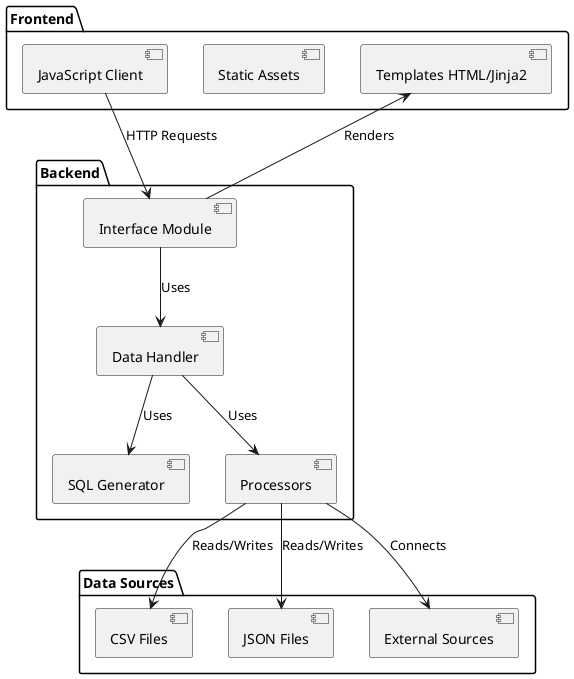
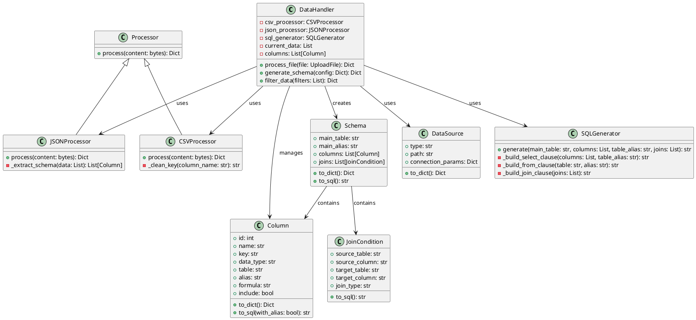
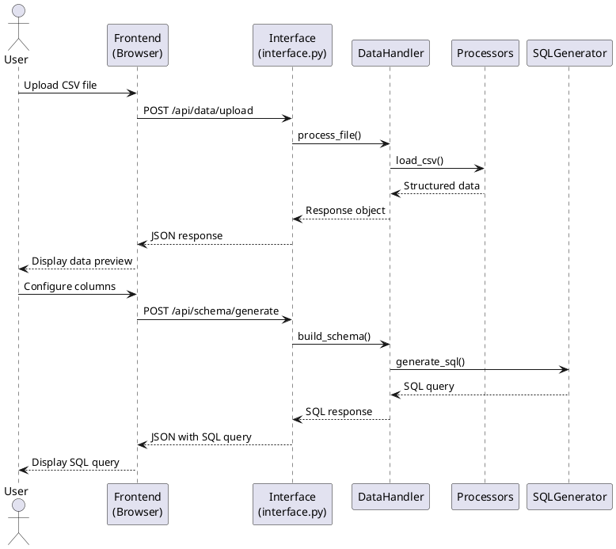

# Architecture Documentation - Data-eyes

This document presents the detailed technical architecture of the Data-eyes project, including class diagrams, data flows, and component interactions.

## Table of Contents

1. [Overview](#overview)
2. [Application Architecture](#application-architecture)
3. [Class Diagram](#class-diagram)
4. [Data Flow](#data-flow)
5. [Main Components](#main-components)
6. [Frontend-Backend Interactions](#frontend-backend-interactions)
7. [Data Management](#data-management)
8. [Database Schema](#database-schema)

## Overview

Data-eyes is a web application following the MVC (Model-View-Controller) pattern adapted for FastAPI. The application consists of the following elements:

- **Frontend**: Web user interface developed with HTML, CSS, and JavaScript, rendered by Jinja2
- **Backend**: REST API developed with FastAPI in Python
- **Data Processors**: Processing modules for different data formats
- **SQL Generator**: Module for generating SQL queries based on user configurations

### Global Architecture Diagram

```
+-------------------+          +---------------------+
|                   |          |                     |
|  Web Interface    |<-------->|  FastAPI Backend    |
|  (HTML/CSS/JS)    |   HTTP   |                     |
|                   |          |                     |
+-------------------+          +---------+-----------+
                                         |
                                         | Uses
                                         v
                      +------------------+------------------+
                      |                                     |
                      |  +----------------+  +-----------+  |
                      |  |                |  |           |  |
                      |  | Data           |  | SQL       |  |
                      |  | Processors     |  | Generator |  |
                      |  |                |  |           |  |
                      |  +----------------+  +-----------+  |
                      |                                     |
                      +-------------------------------------+
```

## Application Architecture

The Data-eyes application follows a modular architecture to facilitate code maintenance and evolution.



## Class Diagram

The class diagram presents the structure of the main entities of the application.



## Data Flow

This diagram illustrates the typical data flow when using the application.



## Main Components

### Interface Module (interface.py)

This module serves as the entry point for the FastAPI application. It defines routes and API endpoints, and coordinates the other components of the system.

**Responsibilities:**
- FastAPI application configuration
- HTTP route definition
- Request/response handling
- HTML template rendering

### Data Handler

The data handler centralizes the business logic for data manipulation.

**Responsibilities:**
- File processing coordination
- Metadata management (columns, types, etc.)
- Interface with data processors
- Interface with SQL generator

### Data Processors

Processors are modules specialized in processing specific data formats.

**Responsibilities:**
- Data extraction from source files
- Data type inference
- Data normalization
- Metadata generation

**Processor Types:**
- CSVProcessor: Processes CSV files
- JSONProcessor: Processes JSON files
- SQLProcessor: Connects to and queries databases

### SQL Generator

This module is responsible for generating SQL queries based on user configuration.

**Responsibilities:**
- Building SELECT clauses
- Managing table joins
- Supporting aliases and conditions
- Formatting SQL queries

## Frontend-Backend Interactions

### Frontend to Backend

1. **Data Loading**
   - Send file via FormData
   - Endpoint: POST /api/data/upload
   - Parameters: file (CSV, JSON)

2. **Schema Configuration**
   - Send JSON configuration
   - Endpoint: POST /api/schema/generate
   - Parameters: main table, columns, joins

3. **Data Filtering**
   - Send filter criteria
   - Endpoint: POST /api/data/filter
   - Parameters: columns, conditions, values

### Backend to Frontend

1. **Data Metadata**
   - Column structure
   - Data types
   - Basic statistics

2. **Data Preview**
   - Subset of loaded data
   - Pagination and sorting

3. **Generated SQL Queries**
   - Formatted SQL
   - Clause documentation
   - Export options

## Data Management

### Data Models

1. **Column**
   - Represents a data column
   - Properties: name, key, type, formula, etc.
   - Methods: to_dict(), to_sql()

2. **Schema**
   - Represents a data schema
   - Collections of columns and joins
   - Methods: to_dict(), to_sql()

3. **JoinCondition**
   - Represents a join between tables
   - Properties: source/target tables, columns, join type
   - Methods: to_sql()

### Data Processing Flow

1. **Loading**
   - Reading the source file
   - Format detection
   - Initial validation

2. **Parsing**
   - Data extraction
   - Type inference
   - Normalization

3. **Structuring**
   - Metadata creation
   - Data model construction
   - Indexing for performance

4. **Transformation**
   - Filter application
   - Sorting and grouping
   - Calculations and formulas

5. **Generation**
   - SQL query construction
   - Formatting and optimization
   - Result export

## Database Schema

Data-eyes is primarily a stateless application that does not require a persistent database. Data is loaded into memory during the user session.

For future versions, an optional database could be implemented for:
- Saving user configurations
- Storing SQL query history
- Maintaining a catalog of data sources
- Managing users and permissions

---

This architecture documentation will evolve with the development of the project. For any questions or suggestions, please contact @Hugues-DTANKOUO.